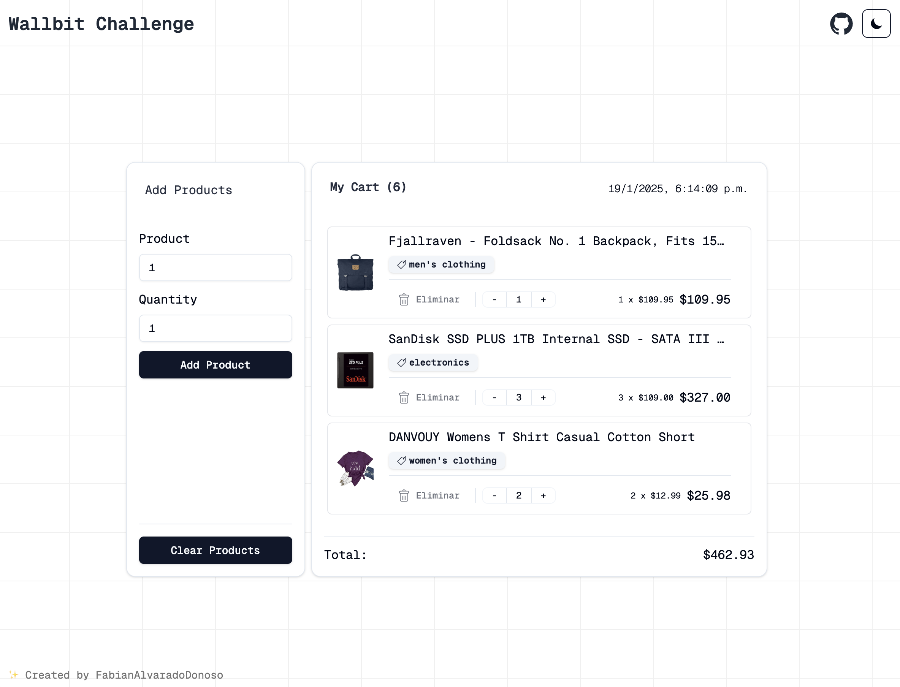

# Wallbit Junior Frontend Challenge

Para este desafío, nuestro cliente nos encargó hacer un carrito de compras para programadores. Tiene un formulario con 2 campos: ID del producto y cantidad. Los programadores habitualmente no necesitan saber ni ver que productos comprar, sino que saben por conexiones astrales cual es el ID del producto que quieren y así los agregan a su carrito.

Cada vez que se agrega un producto, vamos a obtener el producto desde la API y lo vamos a mostrar en una tabla, junto a la cantidad que el usuario eligió.

> Solo lo mostramos visualmente por si hay alguien que no sea programador mirando la pantalla.

La aplicación se vería así:


> Inicialmente no hay productos en el carrito



> Con productos en el carrito

## Requisitos

La API que nos dió nuestro cliente es: [Fake Store API](https://fakestoreapi.com/). El cliente nos dijo que su stack de frontend es React, que prefiere el challenge hecho con eso, pero está abierto a cualquier stack que quieras usar.

- [ ] Podemos agregar productos al carrito.
- [ ] Manejar errores que nos devuelva la API.
- [ ] Mostrar una lista con los productos agregados incluyendo `title`, `price` e `image` del producto y la `cantidad` que el usuario agregó.

## Extras

- [ ] El carrito se persiste al recargar la página.
- [ ] Mostrar el total de productos agregados.
- [ ] Mostrar el costo total del carrito.
- [ ] Mostrar la fecha de creación del carrito.

## 🚀 Ejecutar el proyecto

1. Clonar el repositorio:

```bash
git clone https://github.com/FabianAlvaradoDonoso/wallbit-challenge.git
```

2. Instalar las dependencias:

```bash
# Con pnpm (recomendado):
pnpm install

# Con npm:
npm install
```

3. Ejecutar el proyecto:

```bash
# Con pnpm (recomendado):
pnpm dev

# Con npm:
npm run dev
```

Abrir [http://localhost:5173](http://localhost:5173) para ver la aplicación.
